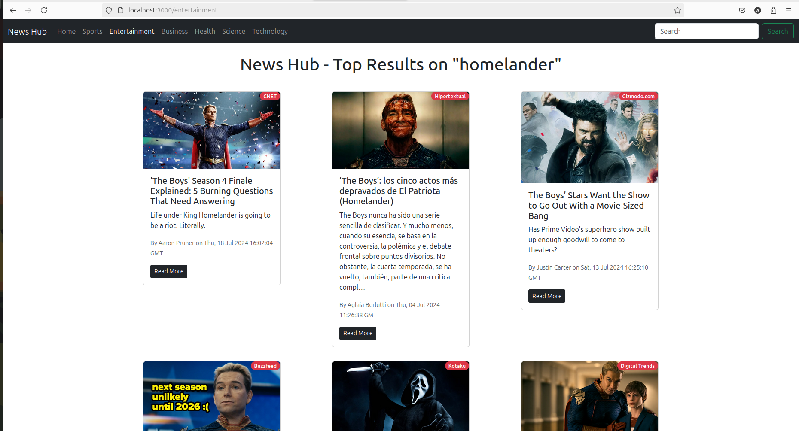
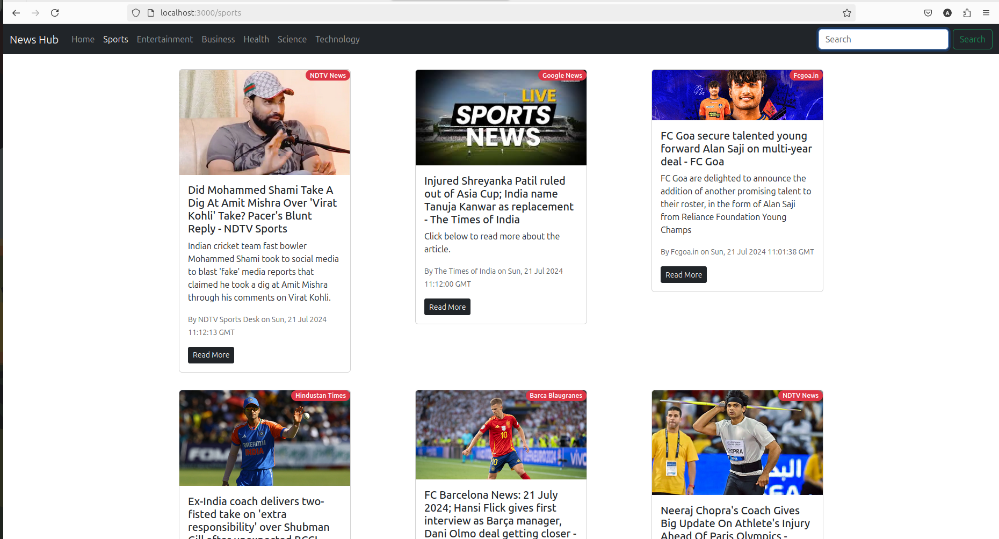
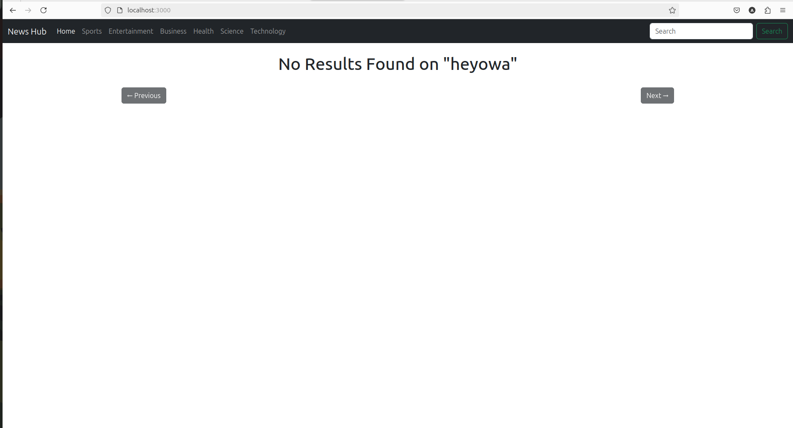
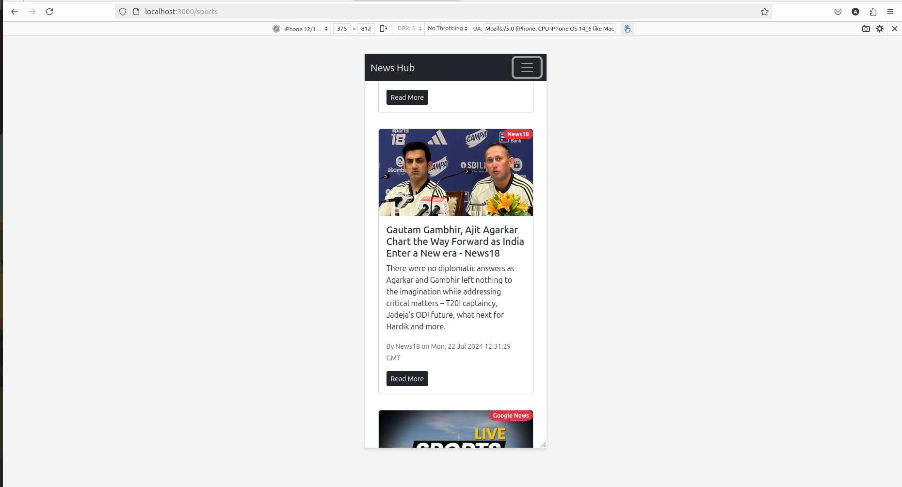
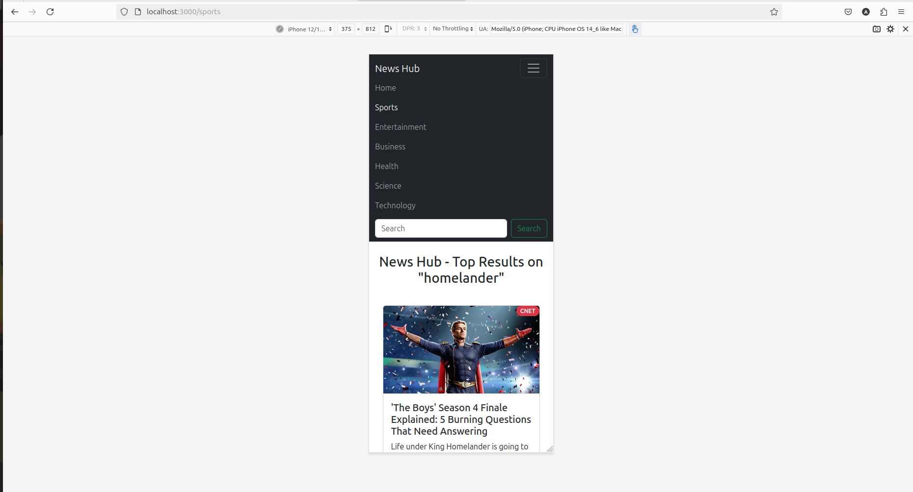

# NewsHub
News Hub is a dynamic and user-friendly news application built with React.js . It is fully responsive and makes use of https://newsapi.org to fetch news and render it. 

## Screenshots
### Search Result


### Sports Page


### Home Page


### Search Result Not Found


### Mobile View


### Mobile View 1


## Features
- **Category-Based News**: Browse news articles across multiple categories, including General, Sports, Entertainment, Business, Health, Science, and Technology. Each category has its dedicated section with curated news content.
- **Search Functionality**: Quickly find news articles related to specific keywords using the search feature. Enter a keyword to view relevant news articles instantly.
- **Loading Bar**: A responsive loading bar provides visual feedback on data loading progress, enhancing the user experience.
- **Dynamic Content**: The app dynamically updates the news content based on selected categories or search queries, ensuring users always see the most relevant information.
- **Image Integration**: Each category is represented by a default image that adds a visual context to the news content.

## Technologies Used

- **React**: Utilizes React for building a fast and interactive user interface with component-based architecture.
- **React Router**: Manages navigation and routing between different news categories and search results.
- **Loading Bar**: Implements `react-top-loading-bar` to show progress during data loading operations.
- **Environment Variables**: Securely manages the API key for news data retrieval using environment variables.
- **Infinite Scroll**: Implements seamless loading of additional content as users scroll down the page, enhancing the browsing experience.


## Install
Clone the repo using
```
git clone https://github.com/Aayush-Bhargav/NewsHub.git
cd NewsHub
```
Install dependencies
```
npm install
```
Create a **.env.local** file in the root directory of the project and add your API key. You can use the provided **sample.txt** file as a template:
```
cp sample.txt .env.local
```
## Launch
```
npm start
```


